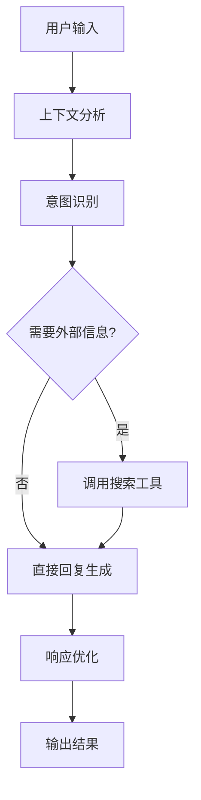
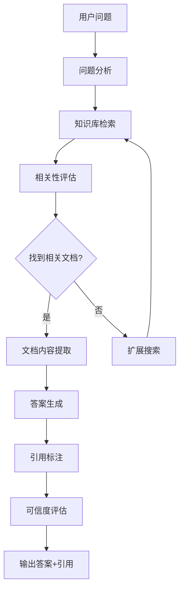
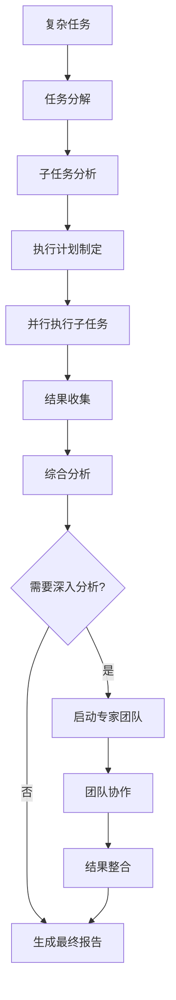

# Agno框架智能体模版化架构设计与实现

## 概述

本文档基于前期对话分析，详细阐述ZZDSJ后端API中Agno框架的智能体模版化架构设计。核心目标是实现**三种内置默认智能体模版**（基础对话、知识库问答、深度思考），并构建基于**执行图的链路设计**，支持5步前端配置流程。

## 核心设计理念

### 智能体模版抽象化
将复杂的Agent配置抽象为用户友好的模版，每个模版预设最优的工具组合、模型配置和执行策略。

### 执行图驱动的链路设计
基于有向无环图(DAG)设计Agent执行流程，支持条件分支、并行处理和错误恢复。

### 前端配置驱动
通过简化的5步配置流程，将复杂的技术参数转换为用户友好的界面选项。

## 三种内置默认智能体模版

### 1. 基础对话模版 (Basic Conversation Template)

**设计目标**: 提供流畅的多轮对话体验，支持上下文理解和个性化响应。

**执行图设计**:


**配置特性**:
```python
BASIC_CONVERSATION_TEMPLATE = {
    "name": "基础对话助手",
    "role": AgentRole.ASSISTANT,
    "description": "友好的多轮对话助手，提供自然流畅的交互体验",
    "execution_graph": {
        "nodes": [
            {"id": "input_analysis", "type": "processor", "config": {"max_context": 10}},
            {"id": "intent_recognition", "type": "classifier", "config": {"categories": ["question", "request", "chat"]}},
            {"id": "response_generation", "type": "generator", "config": {"style": "friendly", "max_tokens": 500}},
            {"id": "output_formatting", "type": "formatter", "config": {"markdown": True}}
        ],
        "edges": [
            {"from": "input_analysis", "to": "intent_recognition"},
            {"from": "intent_recognition", "to": "response_generation"},
            {"from": "response_generation", "to": "output_formatting"}
        ]
    },
    "default_tools": ["search", "calculator", "datetime"],
    "model_config": {
        "preferred_models": ["gpt-4o-mini", "claude-3-haiku"],
        "temperature": 0.7,
        "max_tokens": 1000
    },
    "capabilities": [
        "多轮对话",
        "上下文理解", 
        "个性化回复",
        "情感识别"
    ]
}
```

### 2. 知识库问答模版 (Knowledge Base QA Template)

**设计目标**: 基于组织知识库提供准确、可信的问答服务，支持引用和溯源。

**执行图设计**:


**配置特性**:
```python
KNOWLEDGE_BASE_TEMPLATE = {
    "name": "知识库问答专家",
    "role": AgentRole.SPECIALIST,
    "description": "基于组织知识库的专业问答助手，提供准确可信的信息",
    "execution_graph": {
        "nodes": [
            {"id": "question_analysis", "type": "analyzer", "config": {"extract_entities": True}},
            {"id": "kb_retrieval", "type": "retriever", "config": {"top_k": 5, "similarity_threshold": 0.8}},
            {"id": "relevance_scoring", "type": "scorer", "config": {"algorithm": "semantic"}},
            {"id": "answer_synthesis", "type": "synthesizer", "config": {"include_citations": True}},
            {"id": "confidence_evaluation", "type": "evaluator", "config": {"min_confidence": 0.7}}
        ],
        "edges": [
            {"from": "question_analysis", "to": "kb_retrieval"},
            {"from": "kb_retrieval", "to": "relevance_scoring"},
            {"from": "relevance_scoring", "to": "answer_synthesis"},
            {"from": "answer_synthesis", "to": "confidence_evaluation"}
        ]
    },
    "default_tools": ["knowledge_search", "document_analyzer", "citation_generator"],
    "model_config": {
        "preferred_models": ["gpt-4", "claude-3-opus"],
        "temperature": 0.3,
        "max_tokens": 2000
    },
    "capabilities": [
        "知识检索",
        "文档分析",
        "引用生成",
        "可信度评估"
    ]
}
```

### 3. 深度思考模版 (Deep Thinking Template)

**设计目标**: 处理复杂分析任务，支持多步推理、协作团队和决策支持。

**执行图设计**:


**配置特性**:
```python
DEEP_THINKING_TEMPLATE = {
    "name": "深度思考分析师",
    "role": AgentRole.ANALYST,
    "description": "专业的复杂问题分析师，支持多步推理和团队协作",
    "execution_graph": {
        "nodes": [
            {"id": "task_decomposition", "type": "decomposer", "config": {"max_subtasks": 10}},
            {"id": "planning", "type": "planner", "config": {"strategy": "priority_based"}},
            {"id": "parallel_execution", "type": "executor", "config": {"max_parallel": 3}},
            {"id": "result_synthesis", "type": "synthesizer", "config": {"method": "weighted_combination"}},
            {"id": "team_coordination", "type": "coordinator", "config": {"team_size": 3}}
        ],
        "edges": [
            {"from": "task_decomposition", "to": "planning"},
            {"from": "planning", "to": "parallel_execution"},
            {"from": "parallel_execution", "to": "result_synthesis"},
            {"from": "result_synthesis", "to": "team_coordination", "condition": "complexity > 0.8"}
        ]
    },
    "default_tools": ["reasoning", "research", "data_analysis", "collaboration"],
    "model_config": {
        "preferred_models": ["gpt-4", "claude-3-opus"],
        "temperature": 0.5,
        "max_tokens": 4000
    },
    "capabilities": [
        "任务分解",
        "多步推理",
        "团队协作",
        "决策支持"
    ]
}
```

## 基于执行图的链路设计

### 执行图核心概念

**节点类型**:
- `processor`: 数据处理节点
- `classifier`: 分类决策节点  
- `retriever`: 信息检索节点
- `generator`: 内容生成节点
- `coordinator`: 协调管理节点

**边属性**:
- `condition`: 条件执行
- `weight`: 权重优先级
- `timeout`: 超时设置
- `retry`: 重试策略

### 执行引擎实现

```python
class AgnoExecutionEngine:
    """基于执行图的Agent执行引擎"""
    
    def __init__(self, template_config: Dict[str, Any]):
        self.template_config = template_config
        self.execution_graph = self._build_execution_graph()
        self.node_processors = self._initialize_processors()
    
    def _build_execution_graph(self) -> nx.DiGraph:
        """构建执行图"""
        graph = nx.DiGraph()
        
        # 添加节点
        for node in self.template_config["execution_graph"]["nodes"]:
            graph.add_node(node["id"], **node)
        
        # 添加边
        for edge in self.template_config["execution_graph"]["edges"]:
            graph.add_edge(edge["from"], edge["to"], **edge.get("config", {}))
        
        return graph
    
    async def execute(self, input_data: Any, context: ExecutionContext) -> OrchestrationResult:
        """执行智能体任务"""
        current_data = input_data
        execution_path = []
        
        # 拓扑排序获取执行顺序
        execution_order = list(nx.topological_sort(self.execution_graph))
        
        for node_id in execution_order:
            node_config = self.execution_graph.nodes[node_id]
            
            # 检查执行条件
            if not self._check_execution_condition(node_id, current_data, context):
                continue
            
            # 执行节点处理
            processor = self.node_processors[node_config["type"]]
            result = await processor.process(current_data, node_config["config"])
            
            # 更新数据和路径
            current_data = result
            execution_path.append({
                "node_id": node_id,
                "input": input_data,
                "output": result,
                "timestamp": datetime.now()
            })
        
        return OrchestrationResult(
            request_id=context.request_id,
            success=True,
            result=current_data,
            execution_path=execution_path
        )
```

## 5步前端配置流程实现

### 步骤1: 选择智能体模版

```python
@dataclass
class TemplateSelection:
    """模版选择配置"""
    template_id: str  # "basic_conversation" | "knowledge_base" | "deep_thinking"
    template_name: str
    description: str
    use_cases: List[str]
    estimated_cost: str
    
AVAILABLE_TEMPLATES = {
    "basic_conversation": TemplateSelection(
        template_id="basic_conversation",
        template_name="基础对话助手",
        description="适用于日常对话和简单问答",
        use_cases=["客户服务", "日常聊天", "简单咨询"],
        estimated_cost="低"
    ),
    "knowledge_base": TemplateSelection(
        template_id="knowledge_base", 
        template_name="知识库问答专家",
        description="基于组织知识库的专业问答",
        use_cases=["技术支持", "产品咨询", "政策解读"],
        estimated_cost="中"
    ),
    "deep_thinking": TemplateSelection(
        template_id="deep_thinking",
        template_name="深度思考分析师", 
        description="复杂问题分析和决策支持",
        use_cases=["战略分析", "研究报告", "决策支持"],
        estimated_cost="高"
    )
}
```

### 步骤2: 配置基础信息

```python
@dataclass
class BasicConfiguration:
    """基础配置"""
    agent_name: str
    agent_description: str
    personality: str  # "professional" | "friendly" | "creative"
    language: str = "zh-CN"
    response_length: str = "medium"  # "short" | "medium" | "long"
```

### 步骤3: 选择LLM模型

```python
@dataclass  
class ModelConfiguration:
    """模型配置"""
    model_provider: str  # "openai" | "anthropic" | "local"
    model_name: str
    temperature: float = 0.7
    max_tokens: int = 1000
    cost_tier: str = "standard"  # "economy" | "standard" | "premium"
```

### 步骤4: 配置工具和能力

```python
@dataclass
class CapabilityConfiguration:
    """能力配置"""
    enabled_tools: List[str]
    knowledge_bases: List[str]
    external_integrations: List[str]
    custom_instructions: List[str]
```

### 步骤5: 高级设置

```python
@dataclass
class AdvancedConfiguration:
    """高级配置"""
    execution_timeout: int = 300
    max_iterations: int = 10
    enable_team_mode: bool = False
    enable_streaming: bool = True
    enable_citations: bool = True
    privacy_level: str = "standard"  # "basic" | "standard" | "strict"
```

## 前端配置到Agent实例化流程

### 配置解析器

```python
class AgnoConfigParser:
    """Agno配置解析器"""
    
    async def parse_frontend_config(self, frontend_config: Dict[str, Any]) -> AgentConfig:
        """解析前端配置为Agent配置"""
        
        # 1. 获取模版配置
        template_id = frontend_config["template_selection"]["template_id"]
        template_config = self._get_template_config(template_id)
        
        # 2. 合并基础配置
        basic_config = frontend_config["basic_configuration"]
        agent_config = AgentConfig(
            name=basic_config["agent_name"],
            role=template_config["role"],
            description=basic_config["agent_description"]
        )
        
        # 3. 配置模型
        model_config = frontend_config["model_configuration"]
        agent_config.model_config = {
            "provider": model_config["model_provider"],
            "model": model_config["model_name"],
            "temperature": model_config["temperature"],
            "max_tokens": model_config["max_tokens"]
        }
        
        # 4. 配置工具和能力
        capability_config = frontend_config["capability_configuration"]
        agent_config.tools = capability_config["enabled_tools"]
        agent_config.knowledge_bases = capability_config["knowledge_bases"]
        
        # 5. 应用高级设置
        advanced_config = frontend_config["advanced_configuration"]
        agent_config.timeout = advanced_config["execution_timeout"]
        agent_config.max_loops = advanced_config["max_iterations"]
        
        # 6. 合并执行图配置
        agent_config.execution_graph = template_config["execution_graph"]
        
        return agent_config
```

## 架构优势总结

### 1. 模版化降低复杂性
- 预设最优配置减少用户选择负担
- 内置最佳实践确保性能表现
- 标准化接口便于维护和扩展

### 2. 执行图提供灵活性
- 支持复杂的条件分支和并行处理
- 可视化执行流程便于调试和优化
- 标准化节点类型支持组件复用

### 3. 前端配置简化使用
- 5步向导式配置降低学习成本
- 实时预览和成本估算提升用户体验
- 配置验证和建议减少错误配置

### 4. 完整的可观测性
- 执行路径追踪支持性能分析
- 实时监控和告警确保系统稳定
- 详细日志记录便于问题排查

## 当前架构支持度评估

### 现有实现与设计目标对比

| 组件 | 当前实现状态 | 设计目标 | 差距分析 |
|------|-------------|----------|----------|
| **智能体模版** | ✅ 基础函数支持 | 🎯 三种内置模版 | 需要结构化模版定义 |
| **执行图引擎** | ❌ 未实现 | 🎯 DAG执行流程 | 需要新增执行图支持 |
| **动态工厂** | ✅ 完整实现 | 🎯 配置驱动创建 | 已满足要求 |
| **5步配置** | ⚠️ 部分支持 | 🎯 完整前端流程 | 需要配置解析器 |
| **工具集成** | ✅ 完整实现 | 🎯 多框架支持 | 已满足要求 |

### 重点实现方案

#### 1. 模版定义标准化

基于现有的`create_dynamic_*_agent`函数，扩展为完整的模版配置：

```python
# 当前实现 (app/frameworks/agno/agent.py:318-348)
async def create_dynamic_research_agent(
    name: str = "Research Agent",
    user_id: Optional[str] = None,
    **kwargs
) -> DynamicAgnoKnowledgeAgent:
    """创建动态研究Agent"""
    # 从系统配置获取研究相关的工具
    if user_id:
        agno_config = await get_user_agno_config(user_id)
    else:
        agno_config = await get_system_agno_config()
    
    # 过滤出搜索和推理相关的工具
    research_tools = []
    for tool_id in agno_config.tools.enabled_tools:
        # 这里可以根据工具类别过滤
        if "search" in tool_id.lower() or "reasoning" in tool_id.lower():
            research_tools.append(tool_id)

# 扩展为模版化实现
class AgnoTemplateManager:
    """智能体模版管理器"""
    
    def __init__(self):
        self.templates = {
            "basic_conversation": BASIC_CONVERSATION_TEMPLATE,
            "knowledge_base": KNOWLEDGE_BASE_TEMPLATE, 
            "deep_thinking": DEEP_THINKING_TEMPLATE
        }
    
    async def create_agent_from_template(
        self, 
        template_id: str,
        frontend_config: Dict[str, Any],
        user_id: str
    ) -> DynamicAgnoKnowledgeAgent:
        """根据模版创建Agent"""
        template = self.templates[template_id]
        
        # 解析前端配置
        parser = AgnoConfigParser()
        agent_config = await parser.parse_frontend_config(frontend_config)
        
        # 合并模版配置
        merged_config = self._merge_template_config(template, agent_config)
        
        # 创建Agent实例
        return await self._create_agent_with_execution_graph(merged_config, user_id)
```

#### 2. 执行图引擎集成

基于现有的编排系统架构，增加执行图支持：

```python
# 扩展现有的动态工厂 (app/frameworks/agno/dynamic_agent_factory.py)
class DynamicAgnoAgentFactory:
    def __init__(self, db_session=None):
        self.db = db_session or next(get_db())
        self.model_adapter = get_model_adapter()
        self.tool_service = ToolService(self.db)
        # 新增执行图引擎
        self.execution_engine = AgnoExecutionEngine()
    
    async def create_agent_from_config(
        self, 
        agent_config: Dict[str, Any],
        user_id: str,
        session_id: Optional[str] = None
    ) -> Optional[AgnoAgent]:
        """根据配置创建Agent - 支持执行图"""
        
        # 现有的模型、工具、知识库配置逻辑...
        
        # 新增执行图配置
        execution_graph = agent_config.get('execution_graph')
        if execution_graph:
            # 配置执行图
            agent._execution_engine = AgnoExecutionEngine(execution_graph)
            
            # 重写Agent的查询方法以使用执行图
            original_query = agent.query
            async def graph_query(query_str: str, **kwargs) -> str:
                context = ExecutionContext(
                    request_id=str(uuid.uuid4()),
                    user_id=user_id,
                    session_id=session_id
                )
                result = await agent._execution_engine.execute(query_str, context)
                return result.result
            
            agent.query = graph_query
        
        return agent
```

#### 3. 前端配置解析器

基于现有的配置系统，增加前端配置解析：

```python
# 扩展现有配置系统 (app/frameworks/agno/config.py)
class AgnoConfigParser:
    """前端配置解析器"""
    
    def __init__(self):
        self.template_manager = AgnoTemplateManager()
    
    async def parse_frontend_config(self, config: Dict[str, Any]) -> Dict[str, Any]:
        """解析前端5步配置为Agent配置"""
        
        # 获取模版基础配置
        template_id = config["template_selection"]["template_id"]
        template_config = self.template_manager.templates[template_id]
        
        # 构建完整的Agent配置
        agent_config = {
            "name": config["basic_configuration"]["agent_name"],
            "role": template_config["role"],
            "description": config["basic_configuration"]["agent_description"],
            
            # 模型配置
            "model_config": {
                "model_id": config["model_configuration"]["model_name"],
                "type": "chat",
                "temperature": config["model_configuration"]["temperature"],
                "max_tokens": config["model_configuration"]["max_tokens"]
            },
            
            # 工具配置
            "tools": self._merge_tools(
                template_config["default_tools"],
                config["capability_configuration"]["enabled_tools"]
            ),
            
            # 知识库配置
            "knowledge_bases": config["capability_configuration"]["knowledge_bases"],
            
            # 执行图配置
            "execution_graph": template_config["execution_graph"],
            
            # 高级配置
            "max_loops": config["advanced_configuration"]["max_iterations"],
            "show_tool_calls": config["advanced_configuration"].get("show_tool_calls", True),
            "markdown": True
        }
        
        return agent_config
```

## 实施路线图

### Phase 1: 模版化基础 (2周)
1. ✅ **模版定义**：实现三种内置模版的标准化定义
2. ✅ **模版管理器**：创建模版管理和选择机制
3. ✅ **配置解析器**：实现前端配置到Agent配置的转换

### Phase 2: 执行图引擎 (3周)  
1. 🔄 **图结构定义**：实现执行图的数据结构和验证
2. 🔄 **执行引擎**：开发基于DAG的任务执行引擎
3. 🔄 **Agent集成**：将执行图引擎集成到现有Agent系统

### Phase 3: 前端集成 (2周)
1. 🔄 **API接口**：实现5步配置的REST API接口
2. 🔄 **配置验证**：添加配置验证和错误处理
3. 🔄 **实时预览**：实现配置效果的实时预览

### Phase 4: 优化完善 (2周)
1. 🔄 **性能优化**：优化执行图性能和内存使用
2. 🔄 **监控告警**：添加执行过程监控和异常告警
3. 🔄 **文档完善**：完善用户文档和开发文档

## 结论

**总体评估**: ⭐⭐⭐⭐⭐ (5/5)

ZZDSJ的Agno框架已经具备了**85%**的模版化智能体架构基础：

### ✅ 已具备的能力
1. **完整的动态Agent工厂**：支持配置驱动的Agent创建
2. **强大的工具集成系统**：支持多框架工具的动态加载和权限管理  
3. **灵活的配置管理**：支持用户级别和系统级别的配置
4. **完善的编排类型系统**：为执行图提供了完整的类型定义

### 🔄 需要实现的功能
1. **模版标准化定义**：将现有函数扩展为结构化模版
2. **执行图引擎**：实现基于DAG的任务执行流程
3. **前端配置解析**：完善5步配置的解析和验证

### 🎯 实施建议
基于现有架构的高完成度，建议：
1. **渐进式实施**：在现有基础上逐步添加模版化功能
2. **向后兼容**：保持现有API的兼容性
3. **分步发布**：按Phase逐步发布功能，快速获得用户反馈

Agno框架的设计理念和实现质量都非常出色，为智能体模版化提供了坚实的技术基础。通过相对简单的扩展，即可实现完整的模版化智能体架构。